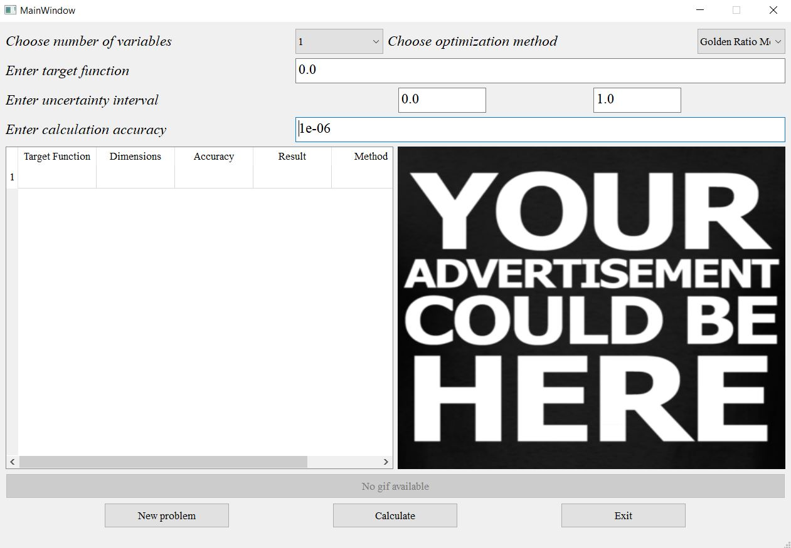
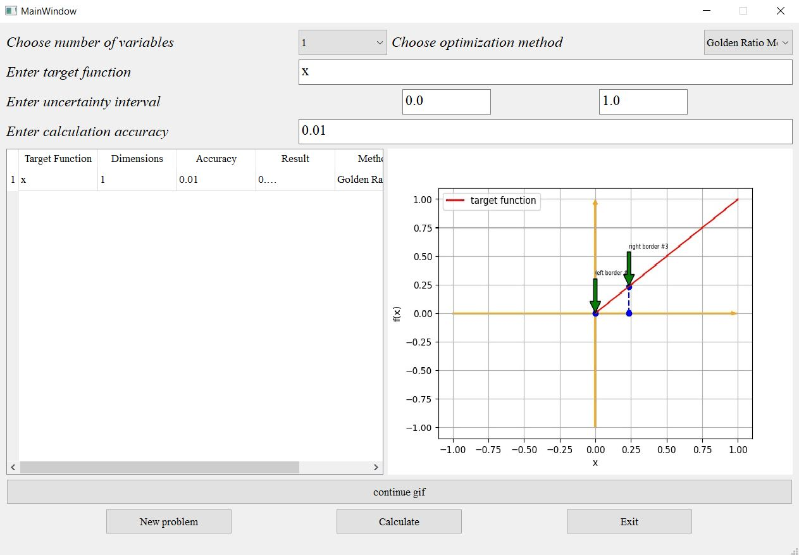
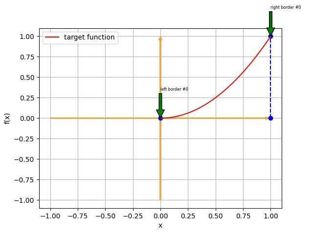

# Rendering Optimization Methods Application

This project is a desktop application for solving minimization problems of varying complexity (At the moment, only one-dimensional minimization with restrictions has been implemented, the project is in the process of being finalized).

## Installation

You can run the application in two ways: from the main file **main.py**, by running this source file through the terminal using the command:

`python -m main`

For the program to work correctly, you must also download all the corresponding external dependencies on python modules 
that are not included in the standard package. For this, you also need to write the following command on the command 
line:

`pip install -r requirements.txt`

## Interface of the application

Next picture is an image of the user interface of the application:

Interface (at the moment) has 4 input fields for the parameters of the optimization problem.
User has the ability to independently set:
+ Target function
+ Calculation accuracy
+ Boundaries of the uncertainty interval

Result of the program execution is the optimum function (left screen part)
+ visual illustration of the minimization process (right screen part).

## Illustration of the process of minimizing a one-dimensional function

In the above image, you can see how the process of minimizing the objective function is drawn:

User can, by pressing the button, leave the minimization process at one of the intermediate iterations.

## Tech Stack 

+ pyqt
+ pytest
+ imageio
+ dataclasses
+ sympy
+ numpy
+ scipy
+ matplotlib
+ pure_protobuf

## Tools
  
+ [flake8](https://pypi.org/project/flake8/)
